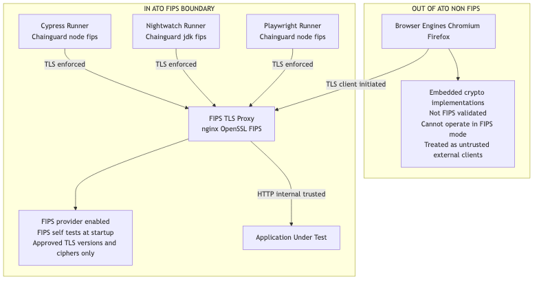

# Overview

This repository contains a FIPS-enabled end-to-end (E2E) test environment for chrome and firefox using multiple E2E test suites for Playwright, Cypress and Nightwatch

1. Nightwatch.js running on a Chainguard JDK-FIPS image
2. Cypress running on a Chainguard Node-FIPS image
3. Playwright is running on a Chainguard Node-FIPS image
4. A full Selenium Grid using Chainguard private images
5. A chainguard FIPS validated proxy for all tests suites using the Chainguard nginx-FIPS image
6. Automated FIPS self-tests and TLS cipher checks that validate cryptographic provider status before running any tests

**NOTE:** You must generate your own self signed certificates in fips-tls/certs for docker-compose to work

**browser-side cryptography is explicitly excluded from the Authorization to Operate (ATO) boundary**



Most modern browsers embed their own cryptographic stacks which are **not FIPS 140-2/140-3 validated** and cannot be configured to operate in FIPS mode. Firefox is the exception

* Chromium: Uses BoringSSL (Google's OpenSSL fork) - not FIPS validated, deeply integrated into browser networking stack

* Firefox: Uses NSS (Network Security Services) - FIPS mode exists 

* WebKit: Custom crypto implementation - not FIPS validated, no FIPS mode available

## Three test runners:

### Nightwatch
* Uses WebDriver to drive Chrome and Firefox
* Java-side crypto uses BouncyCastle FIPS
* TLS cipher checks for localhost proxy over 443

### Cypress
* Node runtime uses OpenSSL FIPS provider
* Runs system openssl-fips-test
* TLS cipher checks for localhost proxy over 443

### Playwright
* Node runtime uses OpenSSL FIPS provider
* Runs system openssl-fips-test
* TLS cipher checks for localhost proxy over 443


**All runtime crypto performed in Java and NodeJS flows through the underlying FIPS-approved cryptographic modules**

i.e...

* HTTPS requests
* verifying certificates
* generating random numbers
* hashing values
* any Node crypto API (crypto.createHash, randomBytes, etc.)

## Summary

This environment provides:

* Full Selenium Grid on Chainguard FIPS-enabled images
* Nightwatch for multi-browser testing
* Cypress on Node-FIPS with system crypto self-tests
* Playwright on Node-FIPS with system crypto self-tests
* Automatic FIPS verification before test execution
* A clean, reproducible, fully containerized E2E testing pipeline


## USAGE

```
docker compose down -v --remove-orphans
docker network prune -f
docker compose pull
docker compose up -d tls-proxy aut
```

### Running Nightwatch 
```
docker compose run --rm e2e-nightwatch
```

Nightwatch Output:
```
nightwatch-runner/tests_output/nightwatch-html-report/index.html
```

- Verifies BounceyCastle FIPS provider leveraging dump.info
- TLS negotiation uses approved protocols and ciphers
- Non-FIPS browser crypto is isolated outside the compliance boundary

### Running Cypress
```
docker compose run --rm cypress
```

- Verifies Node.js is operating in FIPS mode
- Executes the OpenSSL FIPS provider self-test via `openssl-fips-test`
- Performs a real TLS handshake to the TLS proxy and logs:
  - Negotiated TLS protocol (TLS 1.2 / TLS 1.3)
  - Negotiated cipher suite (AES-GCM only)

### Running Playwright

```
docker compose run --rm playwright
```

- Verifies Node.js is operating in FIPS mode
- Executes the OpenSSL FIPS provider self-test via `openssl-fips-test`
- Performs a real TLS handshake to the TLS proxy and logs:
  - Negotiated TLS protocol (TLS 1.2 / TLS 1.3)
  - Negotiated cipher suite (AES-GCM only)

Browser automation uses system Chromium and is configured to ignore certificate
validation errors **only for local, self-signed test certificates**.

### FIPS TLS Boundary

All HTTPS traffic to the Application Under Test (AUT) is terminated by a dedicated TLS reverse proxy (fips-tls/) using Chainguard’s nginx-fips image.

Browser based UI automation (Chromium) is used strictly for UI interaction and is out of cryptographic scope; all in-scope TLS enforcement occurs at the proxy boundary.


